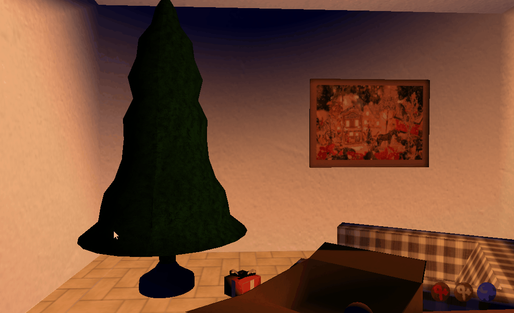
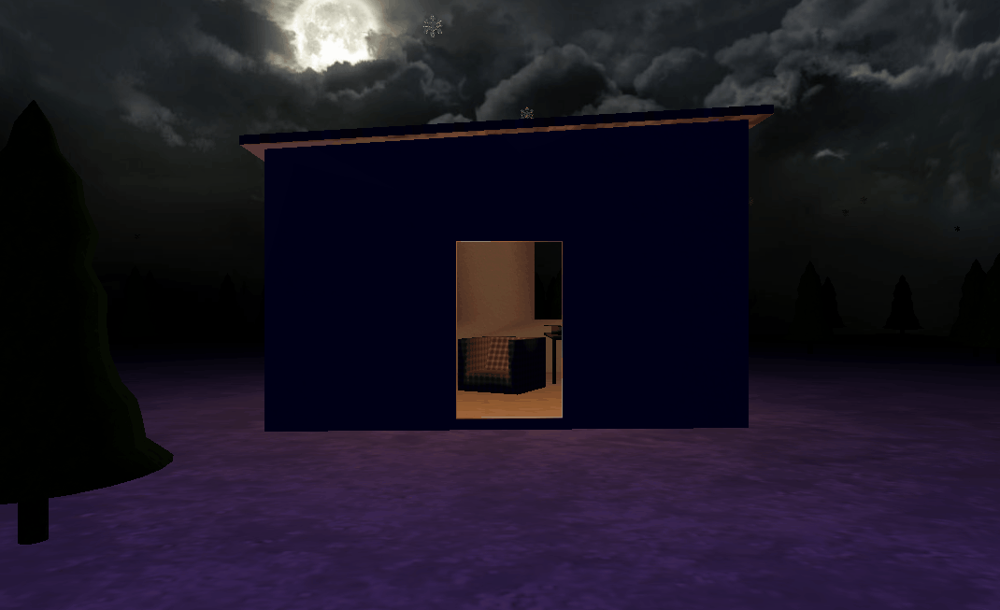
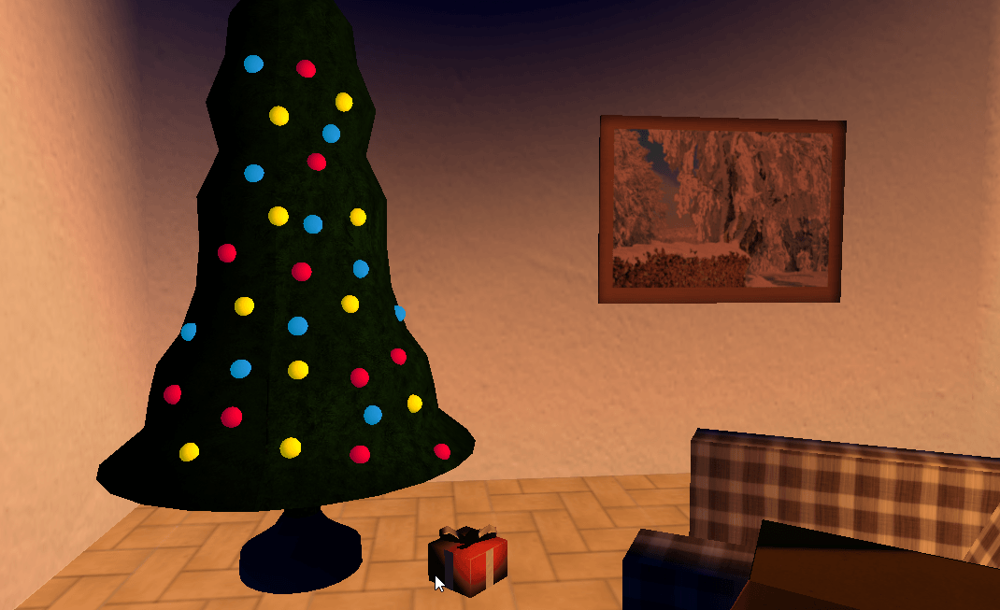
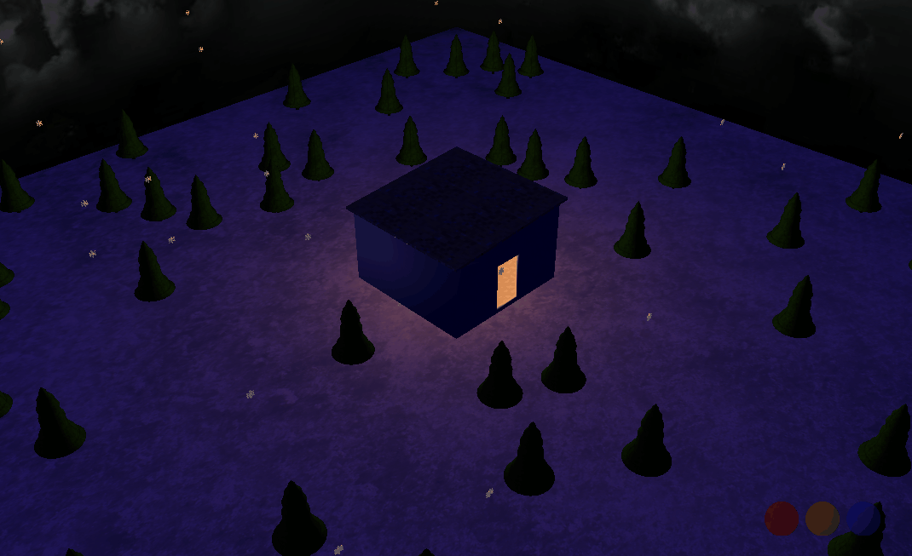
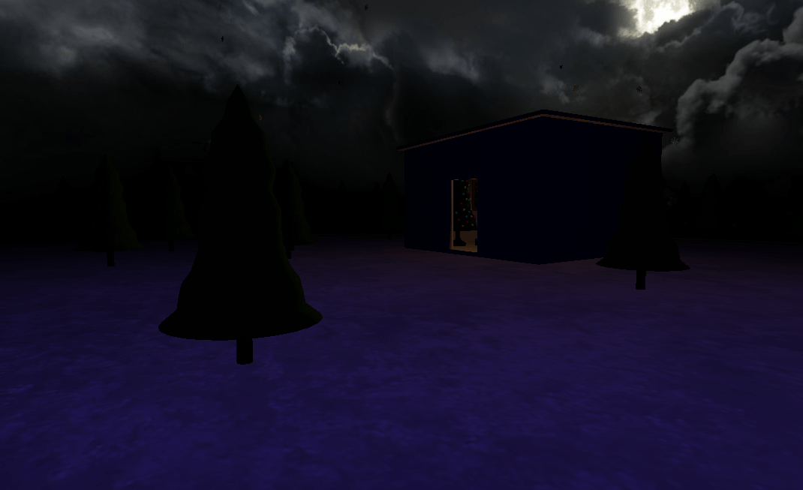

# Vánoce

Interactive Christmas minigame with tree decorations and animated snowflakes. Class project.

All 3D models are my own work. See [texture attributions](#texture-attributions) below.

## Installation

1. Download application [release](https://github.com/JBlackN/vanoce/releases) and unzip it.
2. Download [freeglut 3.0.0 MSVC Package](https://www.transmissionzero.co.uk/software/freeglut-devel/), unzip it and copy `freeglut/bin/freeglut.dll` next to `Vánoce.exe`.
3. Download [Developer's Image Library](https://sourceforge.net/projects/openil/files/) (click "Download Latest Version"), unzip it and copy `DevIL Windows SDK/lib/x86/Release/DevIL.dll` next to `Vánoce.exe`.
4. If you want, adjust app's configuration in `config/config.txt`.
5. Run `Vánoce.exe`.

## Usage

<dl>
  <dt>Left mouse button</dt>
  <dd>Put a tree decoration to the inventory or unwrap Christmas gift</dd>

  <dt><code>Shift</code> + left mouse button</dt>
  <dd>Put ten tree decorations to the inventory</dd>

  <dt><code>W</code>, <code>A</code>, <code>S</code>, <code>D</code>, arrows and mouse movement while any button is pressed down</dt>
  <dd>Movement and camera direction adjustment</dd>

  <dt><code>F1</code></dt>
  <dd>FPS camera (default, remembers settings, has locked movement on Y axis)</dd>

  <dt><code>F2</code></dt>
  <dd>Interior camera (can adjust direction)</dd>

  <dt><code>F3</code></dt>
  <dd>Exterior camera</dd>

  <dt><code>F4</code></dt>
  <dd>Animated camera</dd>

  <dt><code>F5</code></dt>
  <dd>Free camera (takes over previous camera settings, allows Y axis movement)</dd>
 
  <dt><code>F</code></dt>
  <dd>Flashlight (spot)</dd>

  <dt><code>L</code></dt>
  <dd>Household (point) light</dd>

  <dt><code>M</code></dt>
  <dd>Moonlight (directional)</dd>
 
  <dt><code>Shift</code>+<code>M</code></dt>
  <dd>Fog</dd>
 
  <dt><code>Shift</code>+<code>R</code></dt>
  <dd>Scene reload (including configuration &ndash; <code>config/config.txt</code>)</dd>
 
  <dt><code>R</code></dt>
  <dd>Place red decoration on a tree.</dd>

  <dt><code>Y</code></dt>
  <dd>Place yellow decoration on a tree.</dd>

  <dt><code>B</code></dt>
  <dd>Place blue decoration on a tree.</dd>
 
  <dt><code>H</code></dt>
  <dd>Toggle HUD (inventory contents indicator)</dd>
 
  <dt><code>Shift</code>+<code>S</code></dt>
  <dd>Toggle snow</dd>

  <dt><code>Esc</code></dt>
  <dd>Exit application</dd>
</dl>

## Development

Project is tested with [Visual Studio 2015](https://visualstudio.microsoft.com/) and is currently dependent on [PGR-framework](https://cent.felk.cvut.cz/courses/PGR/framework/doc/), which can be downloaded [here](https://cent.felk.cvut.cz/courses/PGR/framework/). See [setup instructions](https://cent.felk.cvut.cz/courses/PGR/framework/doc/en_setup.html).

## Texture attributions

Attributions of textures bundled with [release](https://github.com/JBlackN/vanoce/releases) in `data/textures/` directory.

### cardboard.jpg

- Author: [Sojan Janso](https://pixabay.com/cs/users/SojanJanso-3537296/)
- Link: https://pixabay.com/cs/bezešvé-tileable-textura-karton-1807376/
- License: [CC0 Public Domain](https://pixabay.com/cs/service/terms/#usage)

### fabric.png

- Author: [Prawny](https://pixabay.com/cs/users/Prawny-162579/)
- Link: https://pixabay.com/cs/bezešvé-vzorek-tkanina-materiál-1904560/
- License: [CC0 Public Domain](https://pixabay.com/cs/service/terms/#usage)

### gift.png

- Author: [Pete Linforth (TheDigitalArtist)](https://pixabay.com/cs/users/TheDigitalArtist-202249/)
- Link: https://pixabay.com/cs/bezešvé-textura-pozadí-1657428/
- License: [CC0 Public Domain](https://pixabay.com/cs/service/terms/#usage)

### glass.png

- Author: [Sojan Janso](https://pixabay.com/cs/users/SojanJanso-3537296/)
- Link: https://pixabay.com/cs/bezešvé-textura-tileable-kniha-1910566/
- License: [CC0 Public Domain](https://pixabay.com/cs/service/terms/#usage)

### home.png

Walls:

- Author: [Iwan Gabovitch](https://www.flickr.com/photos/qubodup/)
- Link: https://www.flickr.com/photos/qubodup/7961837172
- License: [CC0 Public Domain](https://creativecommons.org/publicdomain/zero/1.0/)

Roof:

- Author: [Prawny](https://pixabay.com/cs/users/Prawny-162579/)
- Link: https://pixabay.com/cs/abstrakt-dlaždice-vzorek-náměstí-1959393/
- License: [CC0 Public Domain](https://pixabay.com/cs/service/terms/#usage)

Floor:

- Author: [Wolfgang Eckert (anaterate)](https://pixabay.com/cs/users/anaterate-2348028/)
- Link: https://pixabay.com/cs/vzor-dlaždice-podlaha-3097484/
- License: [CC0 Public Domain](https://pixabay.com/cs/service/terms/#usage)

### metal.png

- Author: [Karen Arnold](https://www.publicdomainpictures.net/en/browse-author.php?a=32495)
- Link: https://www.publicdomainpictures.net/en/view-image.php?image=60465
- License: [CC0 Public Domain](https://creativecommons.org/publicdomain/zero/1.0/)

### pictures.png

Wooden frame:

- Author: [mushin3D](https://www.deviantart.com/mushin3d)
- Link: https://www.deviantart.com/mushin3d/art/Seamless-wood-texture-huge-10792-x-10792-559132336
- License: [CC BY-SA 3.0](https://creativecommons.org/licenses/by-sa/3.0/)

Picture 1:

- Author: [rawpixel](https://pixabay.com/cs/users/rawpixel-4283981/)
- Link: https://pixabay.com/cs/box-dárek-přítomný-vánoce-2953722/
- License: [CC0 Public Domain](https://pixabay.com/cs/service/terms/#usage)

Picture 2:

- Author: [congerdesign](https://pixabay.com/cs/users/congerdesign-509903/)
- Link: https://pixabay.com/cs/skořicové-hvězdičky-tyčinky-skořice-2991174/
- License: [CC0 Public Domain](https://pixabay.com/cs/service/terms/#usage)

Picture 3:

- Author: [Jill Wellington (jill111)](https://pixabay.com/cs/users/jill111-334088/)
- Link: https://pixabay.com/cs/vánoce-šťastný-žena-světla-2971961/
- License: [CC0 Public Domain](https://pixabay.com/cs/service/terms/#usage)

Picture 4:

- Author: [Ilona (Couleur)](https://pixabay.com/cs/users/Couleur-1195798/)
- Link: https://pixabay.com/cs/dřevo-palivové-dříví-holzstapel-3016957/
- License: [CC0 Public Domain](https://pixabay.com/cs/service/terms/#usage)

Picture 5:

- Author: [6979608](https://pixabay.com/cs/users/6979608-6979608/)
- Link: https://pixabay.com/cs/děvče-dárek-dárky-vánoce-děti-2931287/
- License: [CC0 Public Domain](https://pixabay.com/cs/service/terms/#usage)

Picture 6:

- Author: [Julita (pasja1000)](https://pixabay.com/cs/users/pasja1000-6355831/)
- Link: https://pixabay.com/cs/zimní-hvězdička-vánoční-led-3008975/
- License: [CC0 Public Domain](https://pixabay.com/cs/service/terms/#usage)

Picture 7:

- Author: [Jill Wellington (jill111)](https://pixabay.com/cs/users/jill111-334088/)
- Link: https://pixabay.com/cs/obec-christmas-vánoce-sníh-zimní-1088143/
- License: [CC0 Public Domain](https://pixabay.com/cs/service/terms/#usage)

Picture 8:

- Author: [Ilona (Couleur)](https://pixabay.com/cs/users/Couleur-1195798/)
- Link: https://pixabay.com/cs/sněhulák-sníh-zimní-bílá-studený-1882635/
- License: [CC0 Public Domain](https://pixabay.com/cs/service/terms/#usage)

### skybox.jpg

- Author: [Jockum F. Skoglund (Hipshot)](https://www.zfight.com)
- Link: https://forums.epicgames.com/unreal-tournament-2003-2004/ut2004-level-editing-modeling-skinning/108243-my-skies-and-and-cliff-textures-large-images
- License: "The licence for these would be, do whatever you want just cred me for what I did."

### snow.jpg

- Link: https://www.goodfreephotos.com/textures/snow-texture.jpg.php
- License: [Public Domain](https://creativecommons.org/licenses/publicdomain/)

### tree.png

Treetop:

- Author: [Spiral Graphics Inc.](http://spiralgraphics.biz/index.htm)
- Link: http://spiralgraphics.biz/packs/plant_bush_tree/?11
- License: http://spiralgraphics.biz/packs/usage_rights.htm

Bark:

- Author: [Ivan Tantsiura a.k.a. iVANGRAPHICS](https://www.deviantart.com/ivangraphics)
- Link: https://www.deviantart.com/ivangraphics/art/Tree-bark-texture-pattern-208493997
- License: "Free for any use, credit me if you loved it"

### wood.jpg

- Author: [mushin3D](https://www.deviantart.com/mushin3d)
- Link: https://www.deviantart.com/mushin3d/art/Seamless-wood-texture-huge-10792-x-10792-559132336
- License: [CC BY-SA 3.0](https://creativecommons.org/licenses/by-sa/3.0/)

### The rest

The following textures are my own:

- ornament\_1.png
- ornament\_2.png
- ornament\_3.png
- ornament\_4.png
- ornament\_5.png
- ornament\_6.png
- ornament\_7.png
- ornament\_8.png
- ornament\_9.png
- ornament\_blue.png
- ornament\_red.png
- ornament\_yellow.png
- overlay\_text.png
